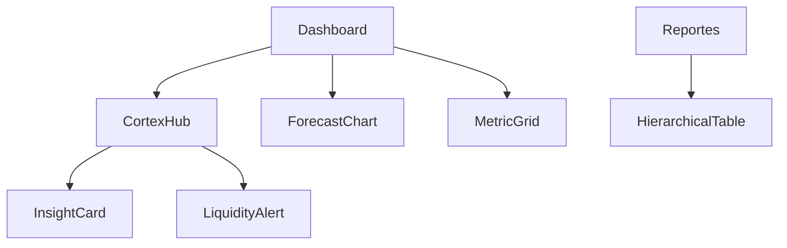

# Component Inventory: TAUROS (Imperial Core)

## 1. Tecnologías Base
- **Backend**: FastAPI, SQLAlchemy (SQLite), Pandas.
- **Frontend**: Next.js 14, Tailwind CSS v4, Lucide Icons.
- **Visualización**: Recharts (composición personalizada de gradientes).

## 2. Componentes UI (Imperial System)

### Átomos y Utilidades
- `FinancialValue`: Formateo dinámico de moneda con colorización semántica.
- `GlassyPanel`: Contenedor base con `backdrop-blur` y `rim-lighting` (CSS variables).
- `StatusPulse`: Indicador animado para procesos de IA activos.

### Organismos (Intelligence Core)
- **`CortexHub`**: Contenedor principal del feed de inteligencia. Gestiona el estado de carga ("Scanning").
- **`InsightCard`**: Representación visual de un hallazgo (Recurrencia, Anomalía, Metadata).
- **`LiquidityAlert`**: Notificación crítica de estado de caja.
- **`ForecastChart`**: Visualización predictiva con sombras de confianza.

---

## 3. Lógica de Inteligencia (Services)

- `InsightsService`: Motor de detección de anomalías y generación de lenguaje natural para hallazgos.
- `ForecastService`: Motor matemático de proyecciones con inyección de lógica de periocidad.
- `RecurrenceEngine`: Helper para identificar ciclos de transacciones mediante frecuencia mensual.

---

## 4. Mapa de Dependencias Interno

---

## 5. Auditoría de Módulos (Status)
- [x] **Cortex Engine**: Operativo v1.0.
- [x] **Forecast**: Operativo v2.0 (con periocidad).
- [ ] **Vault Mode**: Pendiente (Sprint 4).
- [ ] **PDF/Excel Export**: Pendiente (Sprint 4).
