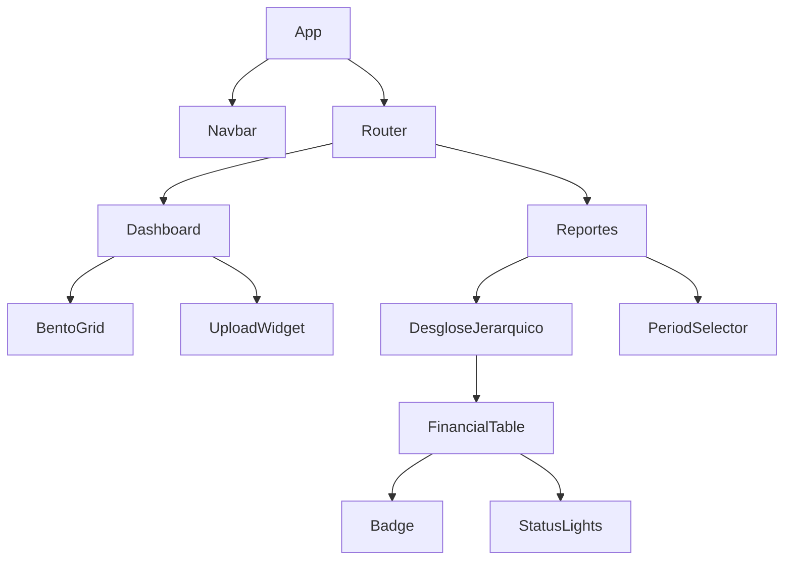

# Component Inventory: TAUROS

## 1. Tecnologías Base
- **Frontend**: React 18/19, Vite, Vanilla CSS.
- **Iconografía**: Phosphor Icons / Lucide Icons.
- **Visualización**: Chart.js / Recharts.
- **Comunicación**: Fetch API / Axios.

## 2. Componentes UI (Design System Externo)

### Átomos / Moléculas
- `Button`: Variantes (Primary, Secondary, Ghost, Danger).
- `Card`: Contenedor base con estilo Glass/Rim.
- `Badge`: Etiquetas de categoría con colores dinámicos.
- `Input`: Campos de texto, fecha y moneda con validación.
- `StatusLights`: Semáforos (Verde/Amarillo/Rojo) para indicadores de confianza.

### Organismos (Componentes de Negocio)
- `Navbar`: Barra lateral de navegación con estados activo/inactivo.
- `PeriodSelector`: Componente global para filtrar todo el sistema por Mes/Año.
- `BentoGrid`: Layout adaptativo para el Dashboard.
- `FinancialTable`: Tabla optimizada para movimientos bancarios con scroll infinito.
- `DesgloseJerarquico`: Componente estrella que muestra el árbol de categorías con expansión recursiva.

---

## 3. Lógica de Negocio (Hooks & Services)

### State Management
- `usePeriod`: Hook para suscribirse al período global (Enero, Febrero...).
- `useFinancialData`: Gestión de fetch y cache de movimientos.
- `useRules`: CRUD de reglas de categorización.

### Services (Backend-less Logic)
- `periodStore.js`: Store liviano para eventos compartidos entre componentes.
- `formatter.js`: Utilidades para convertir números en moneda local ($ ARG) y fechas.

---

## 4. Dependencias del Proyecto (package.json)

```json
{
  "dependencies": {
    "react": "^18.2.0",
    "chart.js": "^4.0.0",
    "phosphor-react": "^1.4.1",
    "framer-motion": "^10.0.0"
  },
  "devDependencies": {
    "vite": "^5.0.0",
    "@testing-library/react": "^14.0.0"
  }
}
```

---

## 5. Mapa de Dependencias Interno


