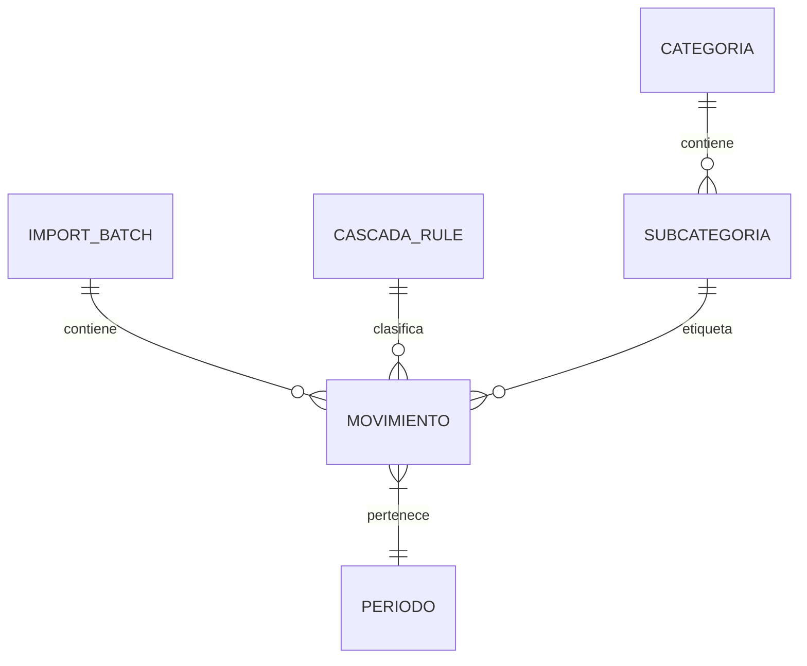

# Data Model Map: TAUROS

## 1. Introducción
**TAUROS** es un sistema de gestión financiera que transforma datos bancarios crudos en información estratégica. Este documento mapea el modelo de datos que sustenta la lógica de categorización, auditoría y reporting.

## 2. Entidades y Atributos

### Movimiento (La entidad central)
Representa una única transacción bancaria.
- `id` (UUID/Int): Identificador único.
- `fecha` (Date): Fecha de la transacción.
- `descripcion_original` (String): El texto crudo del extracto bancario.
- `monto` (Decimal): Valor monetario (positivo o negativo).
- `tipo` (Enum): Ingreso o Egreso.
- `categoria` (String): Categoría principal (ej. "Gastos Operativos").
- `subcategoria` (String): Desglose específico (ej. "Servicios").
- `periodo` (String): Formato `YYYY-MM` para agregación mensual.
- `metadata_extraida` (JSON): Datos detectados (CUIT, CBU, Nombre, Referencia).
- `confianza_porcentaje` (Float): Probabilidad de acierto de la regla aplicada.
- `clasificacion_locked` (Boolean): Si el usuario editó manualmente (Soberanía del Usuario).
- `batch_id` (FK): Relación con el lote de importación.

### Categoria / Subcategoria
Definen el "Plan de Cuentas" del sistema.
- `id`: Identificador.
- `nombre`: Nombre legible.
- `tipo`: Ingreso / Egreso / Transferencia Interna.
- `color_hint` (String): Color asignado para la interfaz.

### CascadaRule (El motor de lógica)
Reglas que definen cómo se categoriza un movimiento.
- `id`: Identificador.
- `patron` (Regex/String): Palabra clave a buscar.
- `categoria_target`: FK a Categoría.
- `subcategoria_target`: FK a Subcategoría.
- `prioridad` (Int): Orden de ejecución (1 es mayor).
- `source`: "Sistema", "Usuario" o "AI-Derived".

### ImportBatch
Control de trazabilidad de archivos.
- `id`: Identificador.
- `fecha_importacion`: Timestamp.
- `nombre_archivo`: Origen de los datos.
- `total_movimientos`: Cantidad de registros creados.

---

## 3. Relaciones (ERD Conceptual)

---

## 4. Restricciones y Reglas de Integridad
- **Unicidad de Movimientos**: Se utiliza un hash de `(fecha, descripcion, monto)` para evitar duplicados en re-importaciones del mismo mes.
- **Cascada de Borrado**: Al eliminar un `ImportBatch`, todos los `Movimientos` asociados se borran automáticamente (Rollback).
- **Consistencia de Signos**: Los ingresos deben ser positivos y los egresos negativos (normalización obligatoria en ingesta).

---

## 5. Metadata y Auditoría
El sistema extrae campos específicos de la `descripcion_original`:
- **CUIT/CUIL**: Detectado mediante RegEx `\d{2}-\d{8}-\d`.
- **Nombres Propios**: Palabras en mayúsculas después de palabras clave (ej. "TRANSFERENCIA DE:").
- **ID de Operación**: Códigos alfanuméricos al final de la descripción.
- **Tags de Importancia**: "Prioritario", "Recurrente", "Anómalo".
