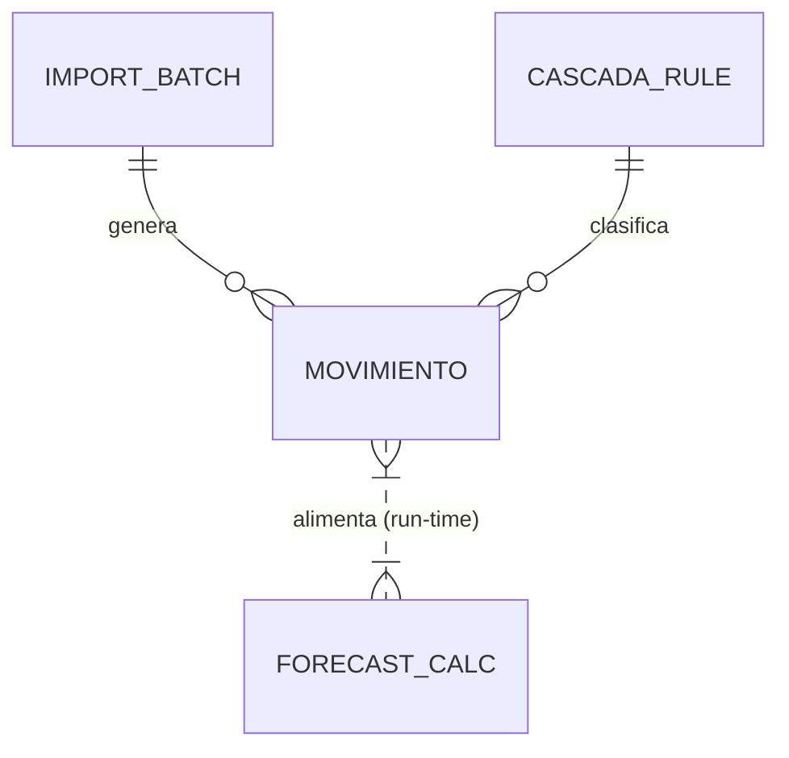

# Data Model Map: TAUROS (Intelligence-Only)

## 1. Introducción
El modelo de datos de TAUROS v2 está optimizado para la trazabilidad y el análisis predictivo. Se ha simplificado para eliminar cualquier rastro de lógica operativa (pagos), centrándose en el flujo de caja y la categorización.

## 2. Entidades y Atributos

### Movimiento (Core Entity)
Reprensenta el átomo de información financiera.
- `id`: Identificador único.
- `fecha`: Fecha de la operación.
- `descripcion`: Texto crudo + metadata inferida.
- `monto`: Valor monetario normalizado.
- `tipo`: Clasificación binaria (Ingreso / Egreso).
- `categoria / subcategoria`: Etiquetas jerárquicas del motor Cascada.
- `confianza`: Score (0-1) de la regla aplicada.

### ImportBatch (Traceability)
- `id`: ID del lote.
- `nombre_archivo`: Origen de los datos.
- `fecha_importacion`: Timestamp de carga.

### CascadaRule (Intelligence)
- `id`: ID de la regla.
- `patron`: Regex o string de coincidencia.
- `categoria / subcategoria`: Destino de la clasificación.
- `peso`: Importancia de la regla en el motor.

---

## 3. Lógica Proyectada (Run-time Data)
Estas entidades no se persisten directamente como tablas, sino que se calculan en memoria para el **Cortex Hub**:

- **RecurrencePattern**: Calculado mediante la frecuencia de transacciones por categoría.
- **ForecastProjection**: Calculado extrapolando patrones históricos hacia el futuro.
- **LiquidityAnomaly**: Hallazgo dinámico basado en desviaciones del promedio móvil.

---

## 4. Relaciones (ERD)

---

## 5. Restricciones Críticas
- **Idempotencia**: No se permiten movimientos duplicados (mismo hash de fecha/descr/monto).
- **Inmutabilidad de Usuario**: Si un movimiento es editado manualmente, el motor Cascada no podrá sobreescribirlo jamás.
