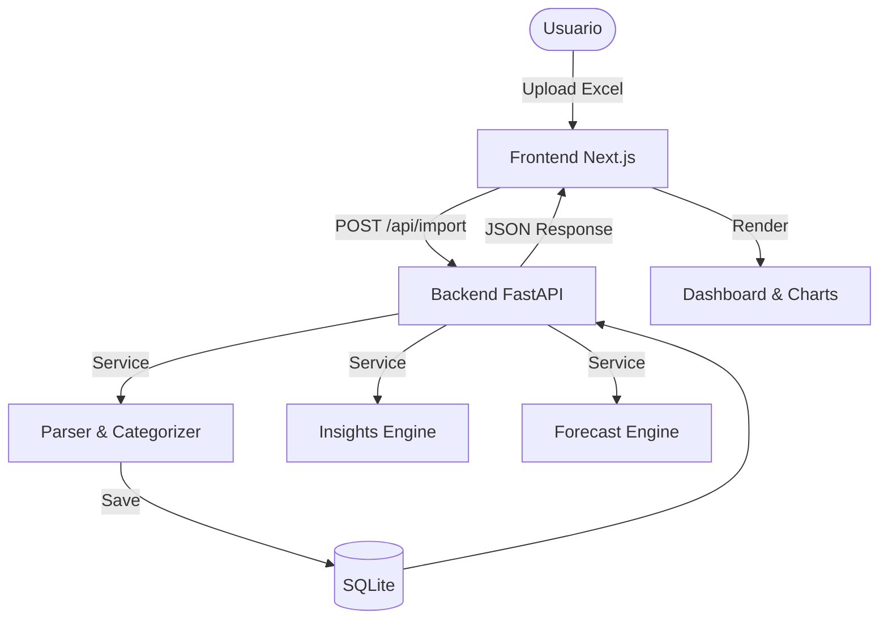

# ARQUITECTURA.md — Arquitectura de TORO_Prime

## 1. Visión General
TORO_Prime utiliza una arquitectura **API-First Modular**.

- **Backend**: FastAPI (Python), capa de servicios desacoplada para lógica financiera.
- **Frontend**: Next.js (React), arquitectura de componentes con hooks y context para estado global.
- **Comunicación**: REST API documentada con OpenAPI (/docs).

## 2. Diagrama de Flujo

## 3. Disposición de Componentes
- **Track A (Backend)**: BN-001 a BN-004.
- **Track B (Frontend)**: BN-005 a BN-008.

---
*Versión: 1.0 (Reflejando prd/ARQUITECTURA.md)*
